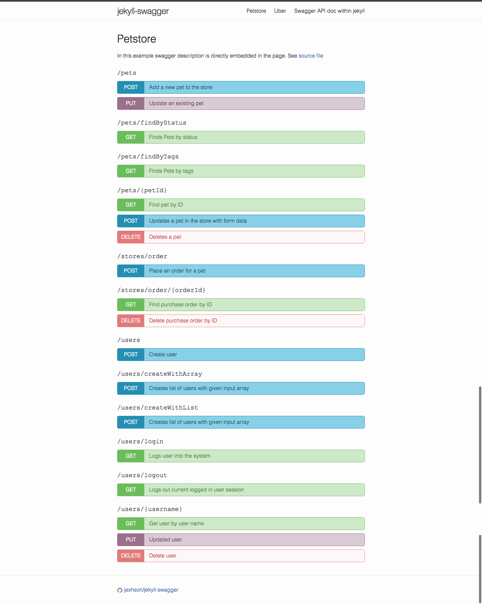

# *jekyll-swagger* layout
This is a test of the [jekyll-swagger](http://jexhson.github.io/jekyll-swagger/) layout for Swagger-based API documentation using Jekyll. 

## Implementation

- [API documentation site](https://kenneth-lau.github.io/jekyll-swagger-copy/)
- [Petstore API](https://kenneth-lau.github.io/jekyll-swagger-copy/example-1.html)
- [Uber API](https://kenneth-lau.github.io/jekyll-swagger-copy/example-2.html)

## Screenshot

## Links
For more information, see the original repository at [jekyll-swagger](http://jexhson.github.io/jekyll-swagger/). 

